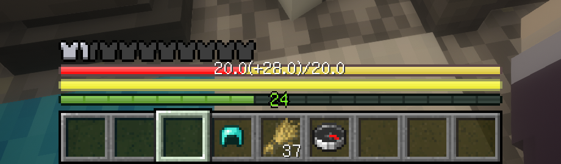
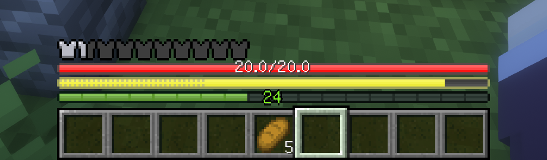
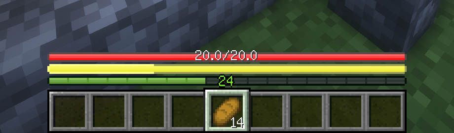
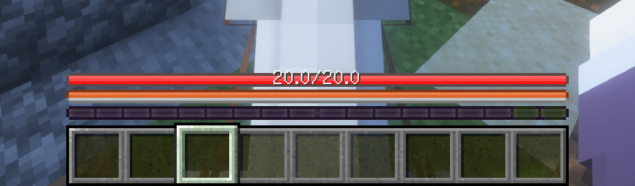
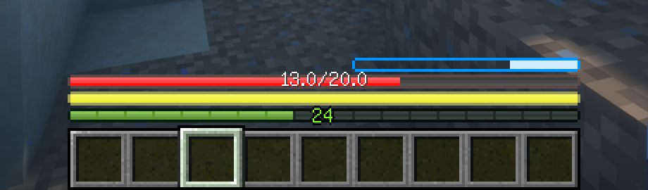
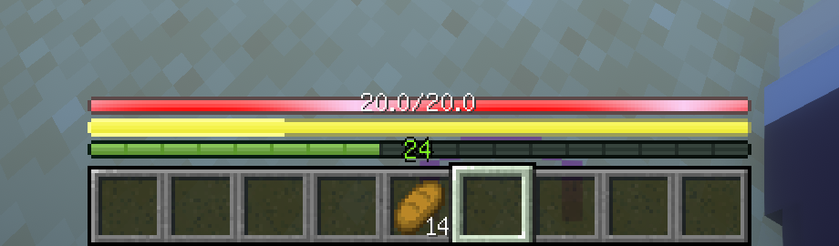

# AsteorBar

 ![](https://img.shields.io/badge/dynamic/json?labelColor=black&color=grey&label=&suffix=%20downloads&query=downloads&url=https://api.modrinth.com/v2/project/QMWG8bVO&style=flat&logo=data:image/png;base64,iVBORw0KGgoAAAANSUhEUgAAACAAAAAgCAMAAABEpIrGAAAAIGNIUk0AAHomAACAhAAA+gAAAIDoAAB1MAAA6mAAADqYAAAXcJy6UTwAAAJPUExURQAAABvZahWnUha1WAYzGQlHIxvZahvZahvZahvZahvZahvZahvZahvZahvZahvZahvZahvZahvZahvZahvZahvZahvZahvZahvZahvZahvZahvZahvZahvZahvZahvZahvZahvZahvZahvZahvZahvZahvZahvZahvZahvZahvZahvZahvZahvZahvZahvZahvZahvZahvZahvZahvZahvZahvZahvZahvZahvZahvZahvZahvZahvZahvZahvZahvZahvZahvZahvZahvZahvZahvZahvZahvZahvZahvZahvZahvZahvZahvZahvZahvZahvZahvZahvZahvZahvZahvZahvZahvZahvZahvZahvZahvZahvZahvZahvZahvZahvZahvZahvZahvZahvZahvZahvZahvZahvZahvZahvZahvZahvZahvZahvZahvZahvZahvZahvZahvZahvZahvZahvZahvZahvZahvZahvZahvZahvZahvZahvZahvZahvZahvZahvZahvZahvZahvZahvZahvZahvZahvZahvZahvZahvZahvZahvZahvZahvZahvZahvZahvZahvZahvZahvZahvZahvZahvZahvZahvZahvZahvZahvZahvZahvZahvZahvZahvZahvZahvZahvZahvZahvZahvZahvZahvZahvZahvZahvZahvZahvZahvZahvZahvZahvZahvZahvZahvZahvZahvZahvZahvZahvZahvZahvZahvZahvZahvZahvZav///9ScwmYAAADDdFJOUwAAAAAAAA8zW3uOYwIBK3rB6Pn+ml18KiGL5HEDquOIH07R/UzKz2zu+uLHIibtafWkVCMNBRqg7/RQuT8EQbvT+5ETDBSU/NAgCSdZlcQKii7mtxJY5fF/7D1SRkB+EcWh4UilOOtPMdTCR1PqN969vmGDCw7G4DSSsAcGHrSPr3bds5CEwDKoXumcZdwcG4KmjayX32A79pjOqRjIFoXynVYVgPi6qxDnL78p2obVJFquNbGZCPdyvHPZ1yhuh8s+iRzcsrEAAAABYktHRMQUDBvhAAAAB3RJTUUH5wQXDwgZWDUtiQAAAqRJREFUOMttU/k7lFEU/k4L4hsxtNAnhRgiJZOiSfbI2oJpmRFCi2kV0aaNVLTIEpVISmnf97r/WO+534yZnqfzw73vOe+559xz7rmKIoVYvLx95vj6qUSqVBW3sGrwnxsQaAwSwcDz5i9g0wxPfmFIqJCyiEgLE4vDl7iD8PGlETotIqOQahlAdJTLA5sWY5JsbNzysHiihEBWViRqRDOlgyFmJVtMq5JWJ5vhvyZlLevrEmUILKl8PihtvYWcYt6QLmNwFjjEb4SSkZnlZLO5yJzcPBg35bODwZfPZxYwWbC5sKjYzwBUkssxSg1wKNsCtHUb89vTy3GwopBxDmcJ9YdDJYB1B9t2WmUtcbtkqt18Mxsp9irsezS2VEu+uka/mqUWSrFd2VsnhLEetoZ9TFv3HwCexdUdjBWi0aH4YTuEvtoPM3/EO1nnuTpEjD2qHIM54DhR0wmA5hZySzIntyknsbZyi8IB0tp07tRpBDKfgeWsdDjHDlFGRIjnl3O0t573gcMFUBeVS1gvlxB1dOZxv0pIu9IF01UDZRdjr1SuZQhxvbvnRrmsMePmrdsrGPRaKP8OLtmn9KM7A4N3xb8yNExUb5RlZt2btpZbXajzPoYkBaDKrtADp3HkYdloo56ndgx37UcHxSP0tIWBGH9cg1nx6TJFTNhS7eCfcA1PJ+GgDbLDs2GuX3V05Ohj0xYSBGumyq/yfApw4EWTRxPJqxQvIF6+ks9Gr0d4nN+8Nbhoi+NdJEwVSc6hVNvHOUvg+5qeDxoP3GQz6x8/qXLuZ6Op7SPy+gNTnydSELabk1Z8Mbs/hlr4dbobfUgxJMS3UdXza9H33jqnA3/OH41FCZ7/l7HW8vOXiWc9GvPf06D953/T2O/EP8HBNtcH0Zm/lqFNUgTAex4AAAAldEVYdGRhdGU6Y3JlYXRlADIwMjMtMDQtMjNUMTU6MDg6MjQrMDA6MDAE5dOaAAAAJXRFWHRkYXRlOm1vZGlmeQAyMDIzLTA0LTIzVDE1OjA4OjI0KzAwOjAwdbhrJgAAACh0RVh0ZGF0ZTp0aW1lc3RhbXAAMjAyMy0wNC0yM1QxNTowODoyNSswMDowMITaQU0AAAAASUVORK5CYII=)

A simple mod to display player's status using slim bars and display entity's status using bars.

## Features

### HUD Overlay

- Vanilla feel. Bars can blink as vanilla hearts do(on regen health, on hurt, and so on).
- Display health, hunger, mount health and more.
- Change the color of the bars while be with regeneration, poison, wither or starvation effects. Frozen also supported.
- Won't be affected by max health. Suitable for situations with high max health.
- Display health and absorption together.
- Display saturation and exhaustion together with hunger.
- Display experience value.
- Bars will flash when the player has low health or hunger.
- Configurable. You can change whether to display some bars.

### Entity info

- Display living entity's health and max health.
- Display absorption of living entity.
- Very simple with good look.
- Dynamic color of health bar. The color will change when the entity's health is low.
- Highly configurable. You can change whether to display bars in many situations. And you can change many properties of the bars(e.g. color,
  scale, offset...).

## Notes

Only Chinese and English localization are guaranteed to be correct. If you want to help with the localization, you can create a pull
request.
Thanks a lot!

The following features will not take effect on servers because they are not synced in vanilla Minecraft

- Saturation and exhaustion
- Absorption of living entities

This [plugin](https://github.com/afoxxvi/AsteorBarServer) for Spigot/Paper server can sync saturation and exhaustion to client.

## Supported Minecraft versions and mod loaders

| Version | Forge  | Fabric | NeoForge |
|---------|--------|--------|----------|
| 1.18.2  | latest | latest |          |
| 1.19.2  | latest | latest |          |
| 1.19.3  | latest | latest |          |
| 1.19.4  | latest | latest |          |
| 1.20    | latest | latest |          |
| 1.20.1  | latest | latest |          |
| 1.20.2  | latest | latest |          |
| 1.20.4  | latest | latest |          |

## Compatibility

| Version | Tough As Nails | Thirst Was Taken |
|---------|:--------------:|------------------|
| 1.18.2  |                |                  |
| 1.19.2  |                |                  |
| 1.19.4  |                |                  |
| 1.20    |                |                  |
| 1.20.1  |                |                  |
| 1.20.2  |     forge      |                  |
| 1.20.4  |                |                  |

## Screenshots

Absorption display together with health.

Exhaustion display together with hunger(Similar to AppleSkin).

Saturation display together with hunger.

Mount health.

Air level.

Regeneration effect.

## Acknowledgements

The mod is inspired by

- [AppleSkin](https://github.com/squeek502/AppleSkin) by squeek502
- [Neat](https://github.com/VazkiiMods/Neat) by VazkiiMods
